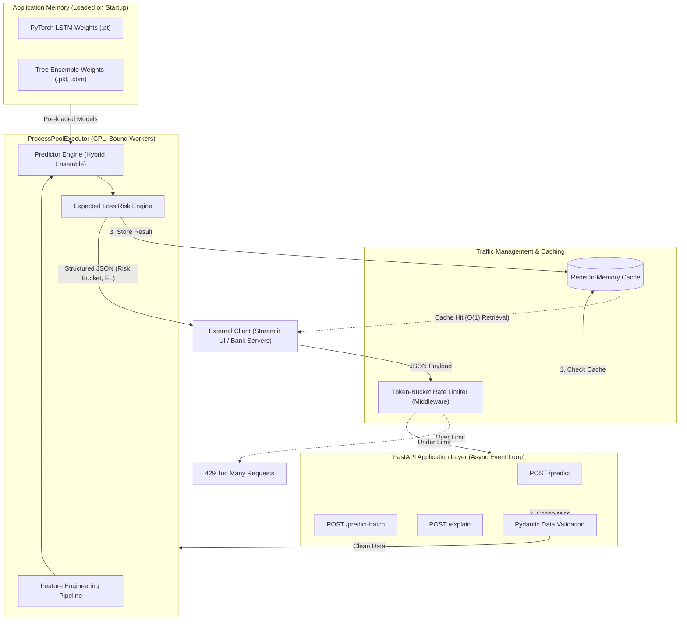

# Pre-Delinquency Risk Prediction API

> **A high-concurrency model serving infrastructure built to serve hybrid ML models (PyTorch/XGBoost) at scale.**

---

## Project Context & Transparency
**Note on Origin:** The core Machine Learning models (Tree Ensembles and PyTorch LSTMs) and the initial Streamlit UI were originally developed collaboratively with a team in the [EarlyShield Repository](https://github.com/SHREESH-git/Pre-delinquency-engine). 

**This repository represents my independent, systems-focused architecture project.** My goal is to decouple the ML inference logic from the frontend and architect a production-grade, asynchronous backend capable of handling high-traffic loads, bypassing the Python GIL, and minimizing inference latency.

---

## Architecture Overview

Currently, financial risk engines are computationally heavy due to simultaneous predictions across tree ensembles and sequential deep learning models. This project wraps those models in a high-performance REST API.



### Current Implementation (MVP)
* **Framework:** FastAPI for asynchronous request handling.
* **Validation:** Strict Pydantic schemas to ensure data integrity before inference.
* **Endpoints:** 
  * Real-time single customer inference (`/predict`)
  * Batch portfolio scoring (`/predict-batch`)
  * Base64-encoded SHAP explainability generation (`/explain`)
* **In-Memory Model Caching:** Heavy `.pt` and `.pkl` weights are loaded into application memory once upon server startup to prevent redundant disk I/O.

### Development Roadmap 
This project is under active development. Upcoming infrastructure upgrades include:
- [ ] **Multi-Processing Integration:** Implementing `ProcessPoolExecutor` to offload CPU-bound ensemble math, bypassing the standard Python Global Interpreter Lock (GIL).
- [ ] **Caching Layer:** Integrating an in-memory Redis cache to instantly return predictions for identical payloads.
- [ ] **Traffic Control:** Implementing a token-bucket rate limiter middleware to ensure service reliability under load.
- [ ] **Load Testing:** Locust benchmarking to measure p90/p99 latency improvements.

---

## Tech Stack

| Layer | Technology |
| --- | --- |
| **Routing & API** | FastAPI, Uvicorn |
| **Data Validation** | Pydantic |
| **Machine Learning** | PyTorch (LSTM), XGBoost, LightGBM, CatBoost |
| **Data Processing** | Pandas, NumPy |
| **Explainability** | SHAP, Matplotlib |

---

## Getting Started

### 1. Environment Setup
Clone the repository and install the backend dependencies:
```bash
git clone https://github.com/YOUR_USERNAME/risk-prediction-api.git
cd risk-prediction-api
pip install -r requirements.txt
```

### 2. Model Weights Integration

*Note: Model weights are excluded from version control due to size constraints.*
Ensure your pre-trained models are placed in the `content/models/` directory before starting the server.

### 3. Launch the Server

Start the Uvicorn ASGI server:

```bash
uvicorn app:app --reload --host 0.0.0.0 --port 8000
```

### 4. Interactive API Documentation

Once the server is running, navigate to the auto-generated Swagger UI to test the endpoints:

* **Swagger UI:** `http://localhost:8000/docs`
* **ReDoc:** `http://localhost:8000/redoc`

---

## Example Payload (`/predict`)

**POST** `http://localhost:8000/predict`

```json
{
  "records": [
    {
      "customer_id": "CUST_001",
      "month": "2026-05",
      "customer_segment": "salaried",
      "region_tier": "tier_1",
      "product_type": "personal_loan",
      "active_products_count": 2,
      "credit_card_utilization": 0.85,
      "total_monthly_obligation": 15000,
      "emi_amount": 8000,
      "days_to_emi": 2,
      "emi_to_income_ratio": 0.45,
      "salary_delay_days": 6,
      "weekly_balance_change_pct": -0.15,
      "atm_withdrawal_amount": 5000,
      "monthly_income": 35000
    }
  ]
}
```

**Response:**

```json
{
  "customer_id": "CUST_001",
  "probability_of_default": 0.1245,
  "risk_bucket": "HIGH",
  "expected_loss": 5420.12,
  "lgd": 0.45,
  "ead": 10387.51
}
```
